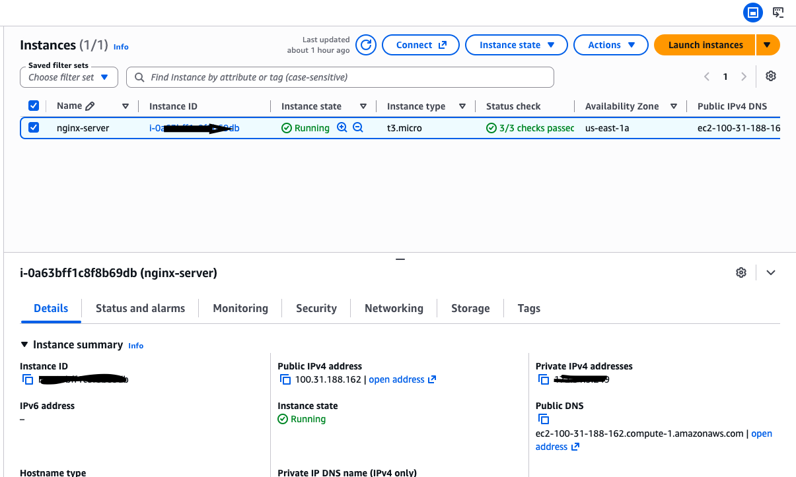
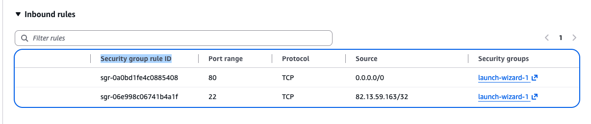
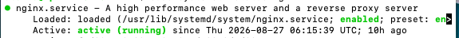
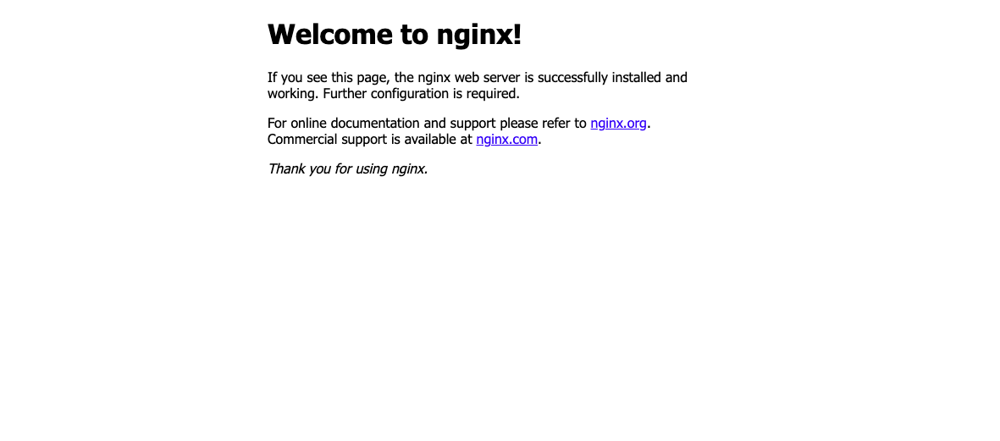
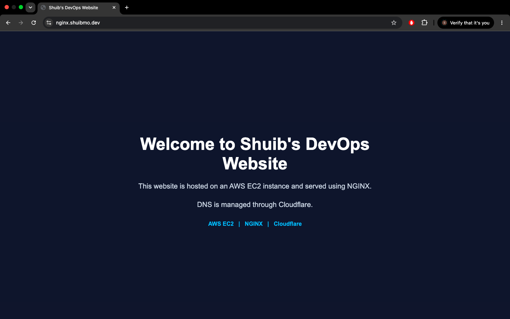

# Networking Assignment

## Domain + EC2 + DNS

This project demonstrates how to deploy an NGINX web server on an AWS EC2 instance and make it accessible through a custom domain using Cloudflare DNS.

## What I Built

For this networking project, I deployed a web server using AWS EC2 and NGINX and connected it to a custom domain using Cloudflare DNS.

The completed setup includes:

- An Ubuntu EC2 instance running in AWS
- NGINX installed and running as the web server
- An AWS Security Group allowing HTTP traffic on port 80 and SSH access on port 22
- A Cloudflare DNS A record for `nginx.shuibmo.dev`
- A custom HTML webpage served by NGINX
- DNS resolution verified using `dig`
- The final website accessible through HTTPS

## 1. AWS EC2 Setup

I launched an Ubuntu EC2 instance in AWS to host the NGINX web server.

The EC2 instance was configured with a Security Group that allows:

- SSH (TCP port 22) for remote administration
- HTTP (TCP port 80) for web traffic

### EC2 Instance



The EC2 instance was successfully launched and configured to host the NGINX web server.

### Security Group

The Security Group was configured to allow SSH traffic on port 22 and HTTP traffic on port 80.



## 2. Domain and DNS Configuration

I used Cloudflare to manage the DNS configuration for my domain, `nginx.shuibmo.dev`.

I created an A record for the nginx subdomain and pointed it towards the public IP address of my EC2 instance. This allows requests to `nginx.shuibmo.dev` to be directed towards the EC2 server.

### Cloudflare DNS


## 3. NGINX Setup

I installed NGINX on my Ubuntu EC2 instance and used it to serve the website.

I checked that NGINX was installed and running with:

```bash
sudo systemctl status nginx
```

The service showed as active (running).

NGINX Running



The NGINX service was running successfully on the EC2 instance.

I then changed the default NGINX page and created my own simple webpage for the project.

Website Before



The default NGINX webpage was displayed before I replaced it with my custom webpage.

Website After



The custom webpage was successfully served by NGINX after replacing the default page.

## 4. Commands I Used

During the project, I used several Linux and networking commands to configure, test, and verify the web server.

Check NGINX Status
I checked that the NGINX service was running:

sudo systemctl status nginx

This confirmed that NGINX was active and running on the EC2 instance.

Connect to the EC2 Instance
I connected to the Ubuntu EC2 instance using SSH:

ssh -i ~/Downloads/nginx-key.pem ubuntu@<EC2-PUBLIC-IP>

This allowed me to remotely administer the EC2 server from my Mac.

Test the Website with cURL
I tested the website through the custom domain using:

curl -v http://nginx.shuibmo.dev

This allowed me to inspect the HTTP response and confirm that the domain was reaching the web server.

Verify DNS
I used dig to check that the domain was resolving correctly:

dig nginx.shuibmo.dev

This helped confirm that the DNS configuration for the nginx subdomain was working correctly.

Check Files and Screenshots
I also used standard Linux commands such as:

ls
ls -lah

These commands were used to inspect files and verify that the project screenshots and other files were present.

## 5. DNS Testing

I tested the DNS configuration using:

dig nginx.shuibmo.dev

The DNS response confirmed that nginx.shuibmo.dev was resolving correctly.

DNS Test


The DNS test confirmed that the custom domain was resolving correctly.

This verified that the custom domain was successfully resolving through DNS and directing traffic towards the web server.

DNS Resolution


The DNS resolution results provided further confirmation that the nginx subdomain was resolving correctly.

## 6. What I Learned

This project helped me understand how different networking and web-hosting components work together.

I learned how to launch and manage an Ubuntu EC2 instance, configure Security Group rules for SSH and HTTP traffic, and install and manage NGINX as a web server.

I also learned how DNS works by creating a Cloudflare A record that connects a custom domain to the EC2 instance. Using dig and curl helped me verify that the DNS and web server configuration were working correctly.

Overall, this project gave me practical experience with AWS, Linux, NGINX, DNS, Cloudflare, networking ports, and hosting a website using a custom domain.

## 7. Challenges and Solutions

One challenge was connecting the custom domain to the EC2 instance. I solved this by configuring the Cloudflare DNS A record and using dig to verify that the domain was resolving correctly.

I also had to configure the AWS Security Group to allow SSH on port 22 and HTTP on port 80 so I could access the server and serve the website.

These challenges helped me understand how DNS, Security Groups, and web servers work together.

## 8. Final Result

The project was successfully completed and the NGINX web server is accessible through my custom domain.

The final website is available at:

https://nginx.shuibmo.dev

The completed setup connects:

AWS EC2 running Ubuntu
NGINX web server
AWS Security Group
Cloudflare DNS
Custom HTML webpage
Custom domain
HTTPS
Live website
The final result demonstrates that the EC2 instance, NGINX server, DNS configuration, and custom webpage are all working together successfully.

```

```
